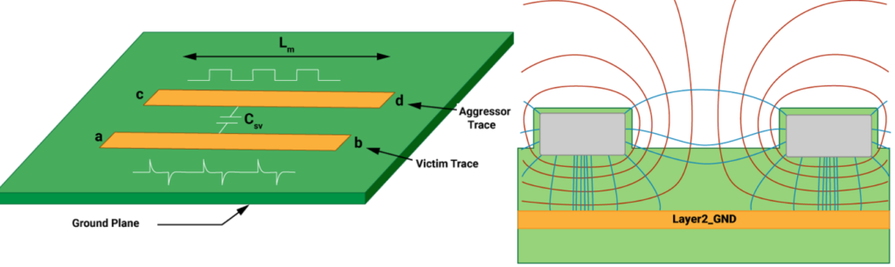
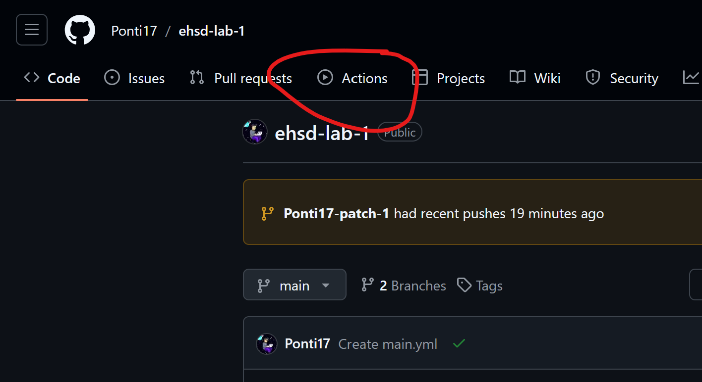
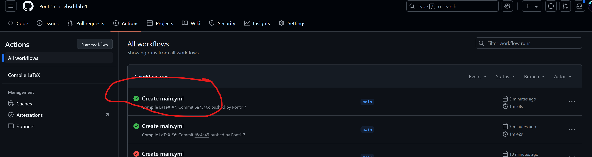
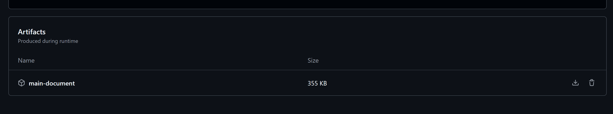

    
  </a>
<h3 align="center">Electronic Hardware System Design</h3>
<h4 aling="center">Lab 2</h4>
  

     
  

## Automated LaTeX Compile

A GitHub action is started on every push to main. The action:

- Starts a docker container with LaTeX
- Compiles document
- Uploads pdf as artifact

This means that the newest version of the assignment is always available for download.

### How to Download

    
  </a>
<h5 aling="center">Go to "Actions"</h5>
  

     
  

    
  </a>
<h5 aling="center">Click on latest successful action</h5>
  

     
  

    
  </a>
<h5 aling="center">Download main document artifact</h5>
  

     
  

